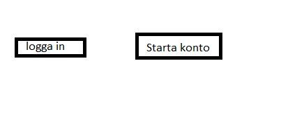
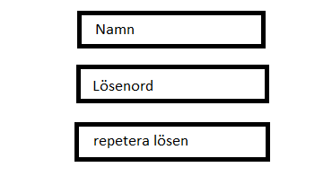
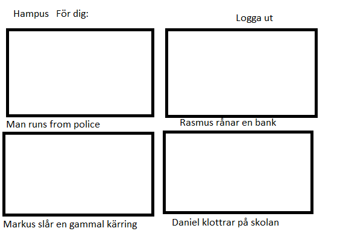
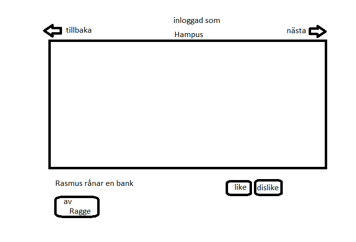
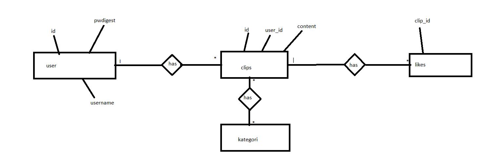

# Projektplan

## 1. Projektbeskrivning (Beskriv vad sidan ska kunna göra).
Jag vill skapa en sida där man kan dela videor samt likea dem. Det ska finnas ett inloggningssystem och om jag hinner och klarar av det ska det finnas ett vän system där man får upp sina vänners videor i första hand. 
## 2. Vyer (visa bildskisser på dina sidor).

## 3. Databas med ER-diagram (Bild på ER-diagram).

## 4. Arkitektur (Beskriv filer och mappar - vad gör/innehåller de?).
